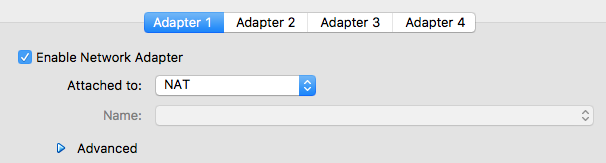
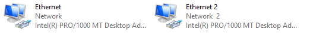
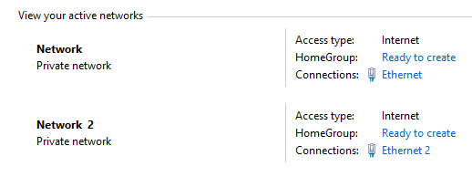

# Virtual Boxing

## NAT

A virtual machine with NAT enabled acts much like a real computer that connects to the Internet through a router. The "router", in this case, is the VirtualBox networking engine, which maps traffic from and to the virtual machine transparently. In VirtualBox this router is placed between each virtual machine and the host. This separation maximizes security since by default virtual machines cannot talk to each other.

## Bridged

With bridged networking, VirtualBox uses a device driver on your host system that filters data from your physical network adapter. This driver is therefore called a "net filter" driver. This allows VirtualBox to intercept data from the physical network and inject data into it, effectively creating a new network interface in software. When a guest is using such a new software interface, it looks to the host system as though the guest were physically connected to the interface using a network cable: the host can send data to the guest through that interface and receive data from it. This means that you can set up routing or bridging between the guest and the rest of your network.

You can attach configure up to 4 adapters in VirtualBox, they do not need to be the same. For example you can set up one for Natted and one Bridged.

http://www.virtualbox.org/manual/ch06.html

# Host

# Guest

