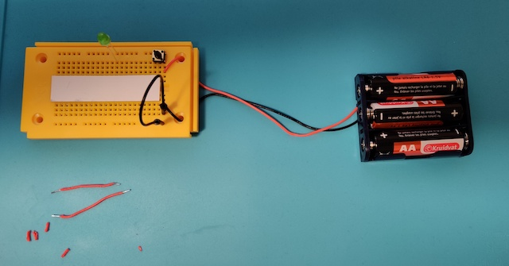

# Door 1

Unboxing...a DYI console! For the real retro feeling :)

The first door...

The components...

## Game: The hidden pipe search

And there you have it: the first retro-game. Aim of the game: beneath the carton is a wire hidden, connecting two (hidden) points on the breadboard. With the 2 red wires a participant must make the right connection for the LED to light up when pushing the button. The LED - by the way - has a built-in resistor of 1 kiloohm otherwise it would light up very bright...once. The batteries supply 4,5V and most LEDs like 2V better.

 

