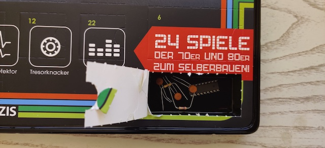

# Door 2

The components...a microcontroller HT46F47, some ceramic capacitors and resistors. The capacitors (aka condensers) act as small batteries that charge and discharge rapidly. The resistors are 27 k&#8486; and 47 k&#8486;.

## Game: The time bomb defusion

Aim of the game: the LED will blink as a ticking timebomb. By placing wires in the right place you can defuse the bomb. If the LED stays on...the bomb explodes! Reset it with the reset button.

