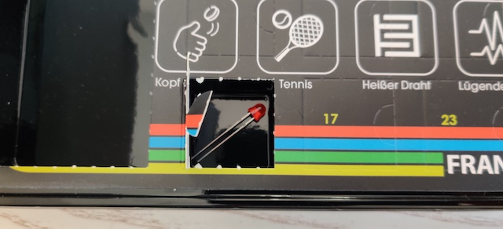

# Door 3

The components...a single red LED, okay that's mildly disappointing. But still: it has the built-in resistor so who can resist?
:P

## Game: Heads or Tails

Aim of the game: Get to know the microcontroller, use it like a (random) switch for lighting up one LED while putting the other one off.

