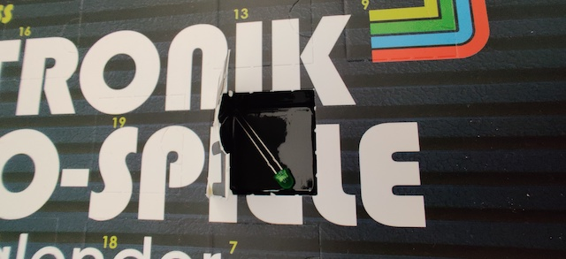
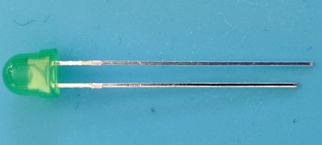

# Door 4

The components...a single green LED. Way better than yesterday when I got the red LED. Better because it is GREEN :) And has the built-in resistor :))

## Game: The slot machine

Aim of the game: Togther with the earlier stuff we now have a slot machine - or if you like - a binary dice. Push the button and the LEDs representing bit will give you: 1=001, 2=010, 3=011, 4=100, 5=101, 6=110.

<iframe width="560" height="315" src="https://www.youtube.com/embed/gSi5n1g_Nck" frameborder="0" allow="accelerometer; autoplay; encrypted-media; gyroscope; picture-in-picture" allowfullscreen></iframe>