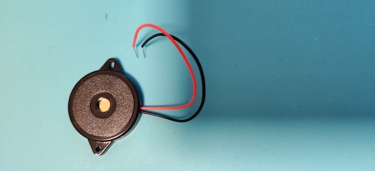

# Door 6

The components...ah! Now we're getting somewhere: a piezo electroacoustic transducer, that - allthough it can can only produce a limited range of frequencies - can function as a speaker. Makes me wonder what the game is going to be.

## Game: Buzz Wire Game

Aim of the game: do NOT buzz the wire :)

<iframe width="560" height="315" src="https://www.youtube.com/embed/JQT1r4_qMx8" frameborder="0" allow="accelerometer; autoplay; encrypted-media; gyroscope; picture-in-picture" allowfullscreen></iframe>