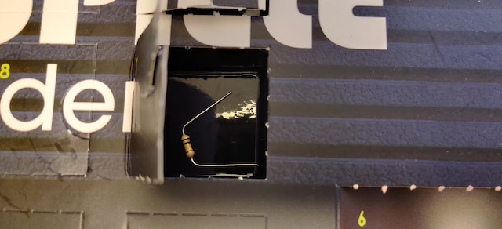
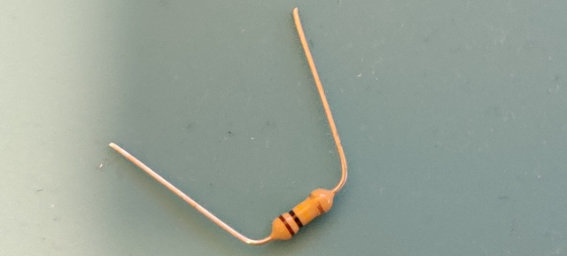
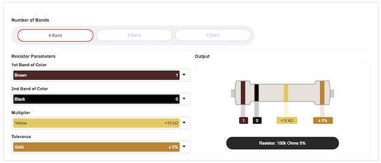

# Door 7

The components...you've got to be kidding me: a single resistor. Hard to resist putting that in a game :) 100 k&#8486; this time, with 5% tolorance. Tolerance is the percentage of error in the resistor's resistance, or how much more or less you can expect a resistor's actual measured resistance to be from its stated resistance. A gold tolerance band is 5% tolerance, silver is 10%, and no band at all would mean a 20% tolerance.

## Game: Buzz Wire Game 2.0

Aim of the game: the game of door 6 is now an obsolete design. Buzz 2.0 is not faster, not more powerful and not more intelligent. It’s just that the speaker sounds a lot deeper with the bigger resistor.

<iframe width="560" height="315" src="https://www.youtube.com/embed/uagBLpJ4bvg" frameborder="0" allow="accelerometer; autoplay; encrypted-media; gyroscope; picture-in-picture" allowfullscreen></iframe>