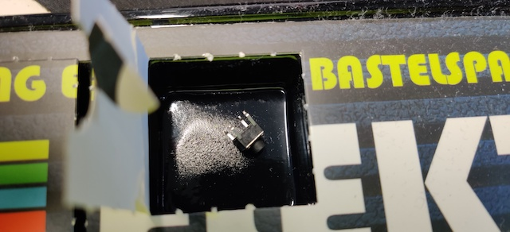
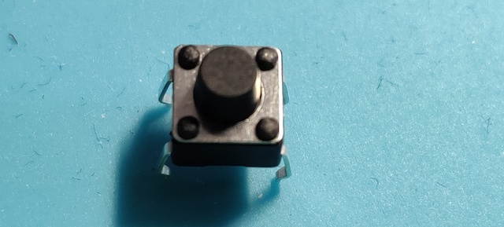

# Door 8

The components...another tactile button switch, somebody must like them. These little clicky switches are standard input "buttons" on electronic projects. They work best in a PCB but can be used on a solderless breadboard.

## Game: Quiz Buzzer

Aim of the game: two people answering questions. The buzzer has different tones so it is always clear who pushed first. Quiz Buzzer Lightyear to the Rescue!

<iframe width="560" height="315" src="https://www.youtube.com/embed/fPzI_lGQ0O0" frameborder="0" allow="accelerometer; autoplay; encrypted-media; gyroscope; picture-in-picture" allowfullscreen></iframe>
