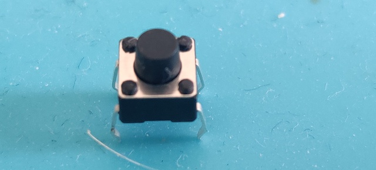

# Door 9

The components...yet another tactile button switch...ait!

## Game: Concentration game

Aim of the game: the 4 LEDs will light up binary. They start at 0000 and run thru a cycle to 1111. Try to stop the lights at 1100 (right button). Reset button will reset the counting sequence. Left button will turn all LEDs on.

<iframe width="560" height="315" src="https://www.youtube.com/embed/Ee2bPY6ZuPI" frameborder="0" allow="accelerometer; autoplay; encrypted-media; gyroscope; picture-in-picture" allowfullscreen></iframe>
