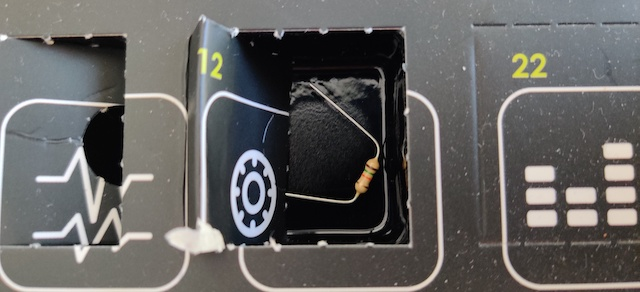
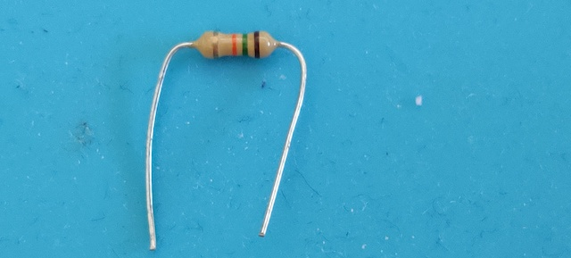
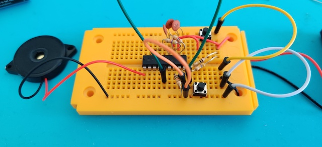

# Door 12

The components...resistance day again, this time it is 15 k&#8486; of resistance. Did someone say pull-up resistor? (In electronic logic circuits, a pull-up resistor or pull-down resistor is a resistor used to ensure a known state for a signal. It is typically used in combination with components such as switches and transistors, which physically interrupt the connection of subsequent components to ground). A.o.t. a current limiting resistor that is used to reduce the current in a circuit.

## Game: Hearing test

Aim of the game: Who can hear the highest tone?

