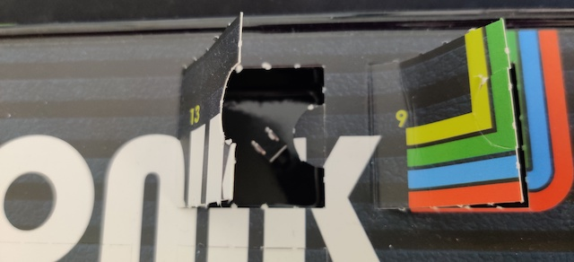
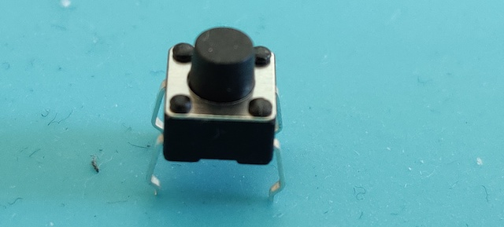

# Door 13

The components...a mini push button. A classic push to make momentary switch (SPST Momentary). They only remain in their on state as long as they’re being actuated (pushed). Connection of ths Single Pole, Single Throw switch is normally easy, the side where the pins come out is like a staple. 2 pins is a staple. Pushing the button will connect two staples and create a circuit.

## Game: Safecracker

Aim of the game: Crack the safe (code)

<iframe width="560" height="315" src="https://www.youtube-nocookie.com/embed/FTmHuYuhgR8" frameborder="0" allow="accelerometer; autoplay; encrypted-media; gyroscope; picture-in-picture" allowfullscreen></iframe>