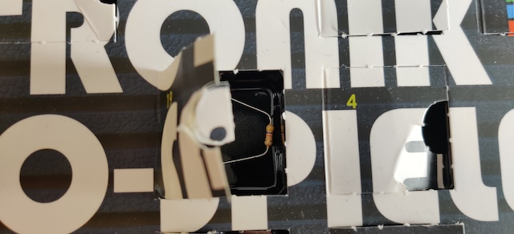
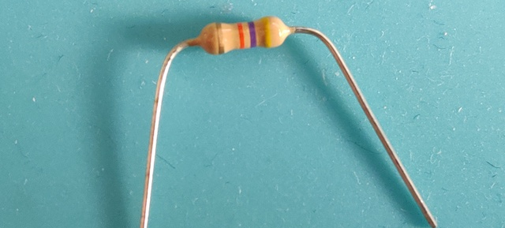
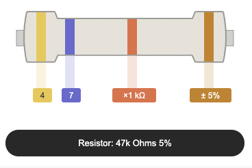
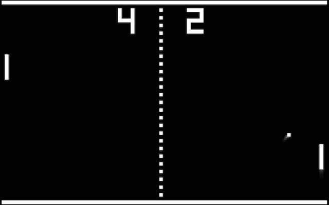

# Door 19

The components...a through-hole resistor with long, pliable leads. This time it is 47 k&#8486; of resistance.

## Game: Pong

Aim of the game: We all know Pong, don't we? The LEDs will move by themselves, you just have to time the entry right.

<iframe width="560" height="315" src="https://www.youtube.com/embed/6iLeEB0frDw" frameborder="0" allow="accelerometer; autoplay; encrypted-media; gyroscope; picture-in-picture" allowfullscreen></iframe>

Dieser tag gibts auch ein [kostenloses E-book "Schnelleinstieg Eleltronik"](https://www.franzis.de/schnelleinstieg-elektronik-adventskalender), jawohl!