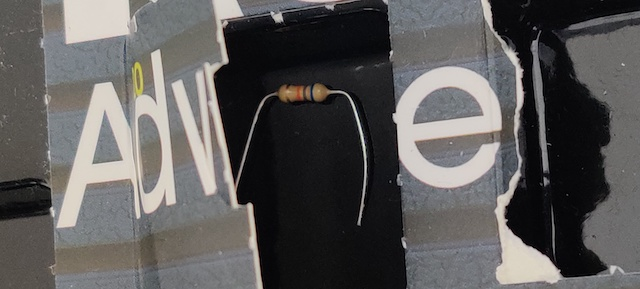
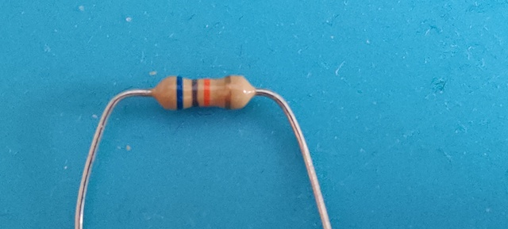
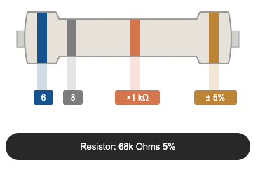
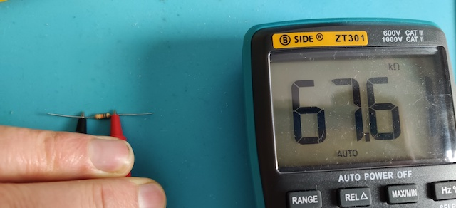

# Door 20

The components...a through-hole resistor with long, pliable leads. This time it is 68 k&#8486; of resistance.

Well..almost!

## Game: Ping Pong Pro

Aim of the game: A "profi" version of yesterda's game. This one's more like the real Pong.

<iframe width="560" height="315" src="https://www.youtube.com/embed/_vaSh8SUrqg" frameborder="0" allow="accelerometer; autoplay; encrypted-media; gyroscope; picture-in-picture" allowfullscreen></iframe>
