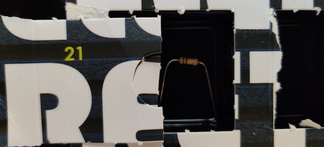
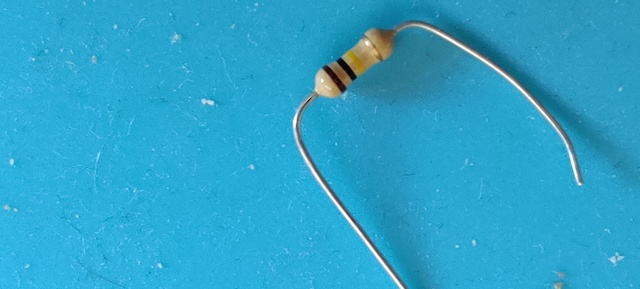
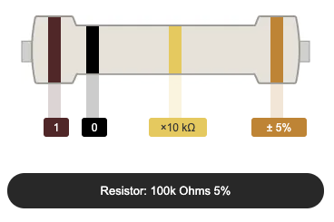
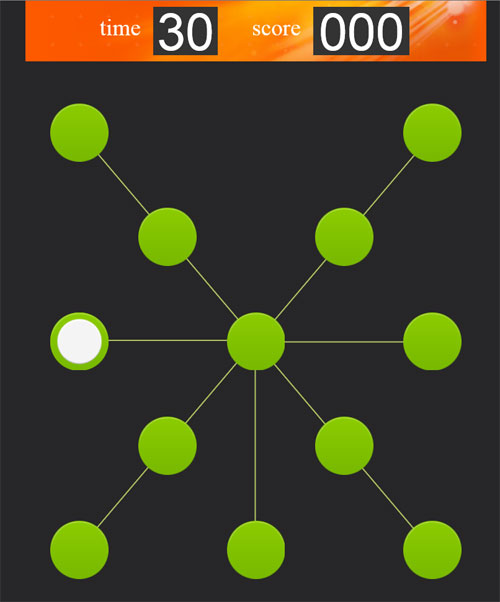

# Door 21

The components...a thin film of conductive (though still resistive) material wrapped in a helix around and covered by an insulating material. This time it is 100 k&#8486; of resistance.

## Game: Reaction Test

Aim of the game: Be quick!

<iframe width="560" height="315" src="https://www.youtube.com/embed/JRLKNXJ-C4M" frameborder="0" allow="accelerometer; autoplay; encrypted-media; gyroscope; picture-in-picture" allowfullscreen></iframe>

