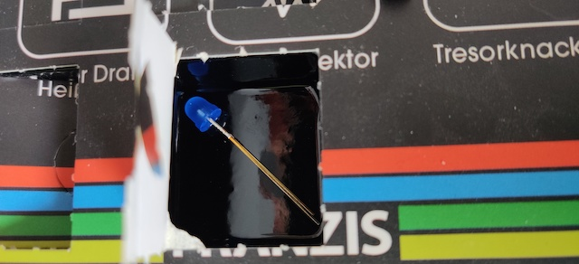
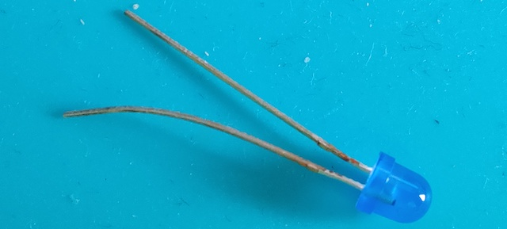

# Door 23

The components...a semiconductor light source that emits light when current flows through it. Blue.

## Game: Die Elektronische Grille

Aim of the game: Search for the annoying sound and the faint blue light when you hide this contraption in the house

<iframe width="560" height="315" src="https://www.youtube.com/embed/-yyaHbO83fA" frameborder="0" allow="accelerometer; autoplay; encrypted-media; gyroscope; picture-in-picture" allowfullscreen></iframe>
