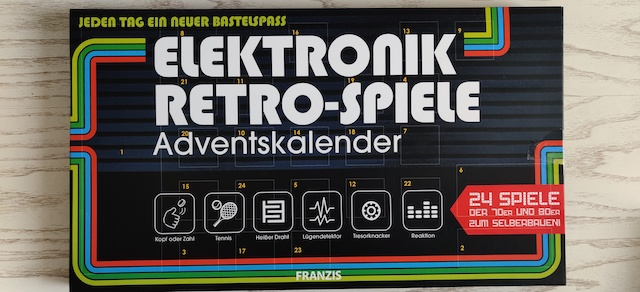

# Advent

An Advent calendar is a special calendar used to count the days of Advent in anticipation of Christmas. Nowadays there are a lot of different Advent calenders, even Electronic ones. I have always found Advent calenders fun and what more fun is one with electronics? So, after some shopping around I settled on this (for EUR 14,69 on Amazon.de):

> Elektronik Retro Spiele Adventskalender 2019 | 24 Spiele der 70er und 80er zum Selberbauen ohne Löten | Jeden Tag ein neuer Bastelspaß

(Electronic Retro-Games)

A retro-game a day keeps the computer away :) Not only fun but also gut for my German! What follows is a detailed account of 24 days with my Advent calender.