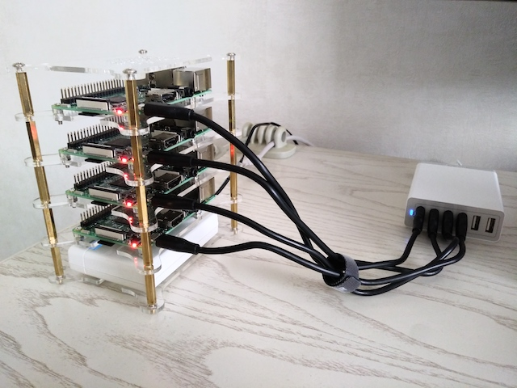
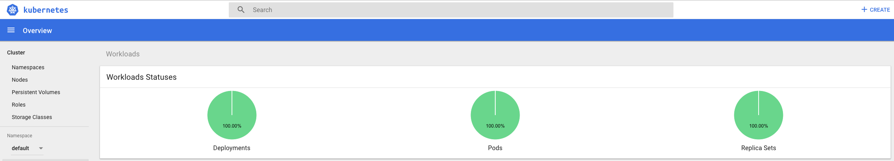
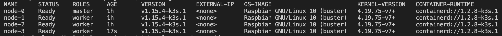

# Kubernetes on raspberry PIs (k8s on pis)

My obligatory k8s cluster on raspberry PI is based on [this repo](https://github.com/alexellis/k8s-on-raspbian). I set out to make the cluster portable so I can use it anywhere, a.o. for presentation/training purposes. For that I use a wireless AP (bottom shelf) and headless boots (add ssh and wpa_supplicant files to boot of sd card of each PI).

Every PI will boot into the wireless netwerk running on the AP. I'll join the same netwerk with my laptop and presto, I can ssh to each PI. Additionally the AP is connected by cable or WiFi (hotspot) to the internet.

## go dasher

Offcourse a [Web UI](https://kubernetes.io/docs/tasks/access-application-cluster/web-ui-dashboard/) every now and then is nice, so deploy then tunnel (or `kubectl proxy`) et voilà!

## update

Above setup was based on `kubeadm` but with k3s from [https://rancher.com/](Rancher) you get a fully compliant yet lightweight Kubernetes distribution, of which the intallation is easy to autmate with [https://github.com/alexellis/k3sup#-micro-tutorial-for-raspberry-pi-2-3-or-4-](k3sup). Up-and-running in literally minutes.

