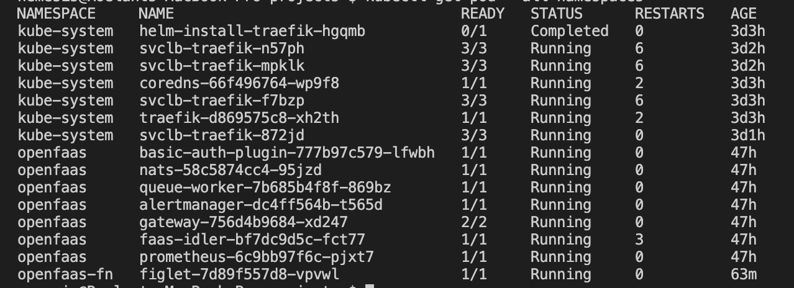
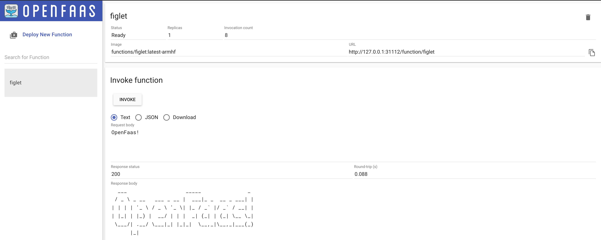
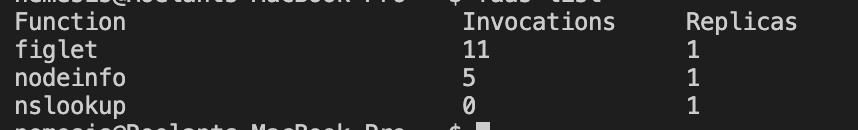

# Kubernetes on raspberry PIs (k8s on pis)

My obligatory k8s cluster on raspberry PI is based on [this repo](https://github.com/alexellis/k8s-on-raspbian). I set out to make the cluster portable so I can use it anywhere, a.o. for presentation/training purposes. For that I use a wireless AP (bottom shelf) and headless boots (add ssh and wpa_supplicant files to boot of sd card of each PI).

Every PI will boot into the wireless netwerk running on the AP. I'll join the same netwerk with my laptop and presto, I can ssh to each PI. Additionally the AP is connected by cable or WiFi (hotspot) to the internet.

## go dasher

Offcourse a [Web UI](https://kubernetes.io/docs/tasks/access-application-cluster/web-ui-dashboard/) every now and then is nice, so deploy then tunnel (or `kubectl proxy`) et voilà!

## update

Above setup was based on `kubeadm`. But now with k3s from [Rancher](https://rancher.com/) you get a fully compliant yet lightweight Kubernetes distribution of which the installation onto Raspberry PI is easy to automate with [k3sup](https://github.com/alexellis/k3sup#-micro-tutorial-for-raspberry-pi-2-3-or-4-). Up-and-running in literally minutes: `kubectl get node --output wide`

### openfaas

Interesting as a kube-cluster may be, what fun it is without functions (as a service)? Enter OpenFaaS: Serverless Functions Made Simple. First install OpenFaaS `k3sup app install openfaas`, and we're done...`kubectl get pod --all-namespaces`

#### openfaas ui

I believe some tinkering is in order; get the (already set) basic auth password from kubectl `PASSWORD=$(kubectl get secret -n openfaas basic-auth -o jsonpath="{.data.basic-auth-password}" | base64 --decode; echo)`. Forward the gateway port: `kubectl port-forward svc/gateway -n openfaas 31112:8080 &` and point your browser at http://127.0.0.1:31112/ui/. Now login with `admin and $PASSWORD`.

#### openfaas cli

- Install faas-cli: `brew installl faas-cli`
- Forward the gateway port: `kubectl port-forward svc/gateway -n openfaas 31112:8080 &`
- `export OPENFAAS_URL=http://127.0.0.1:31112`
- `echo -n $PASSWORD | faas-cli login --username admin --password-stdin`

You are now logged in and `~/.openfaas` with `config.yml` is created. Now `faas list` will get me:

