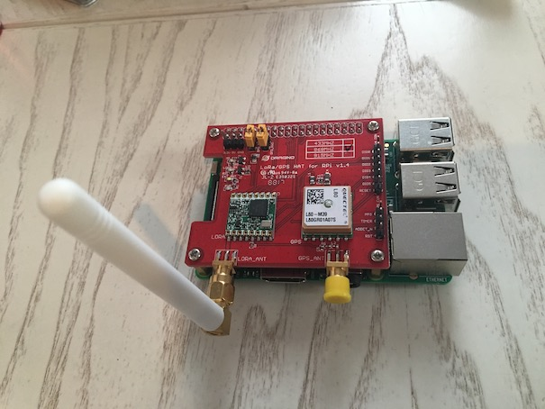

# LoRa Gateway

Raspberry PI with LoRa/GPS HAT for Raspberry Pi - 868MHz

## Hardware On Top

Yeah fun, I've got an old pi model b lying around but the hardware on top (hat) specification only came out in 2014 (B+ model with 40 GPIO pin layout). My 2012 model has a 26 pin layout so that won't fly. Buy a new one :(
