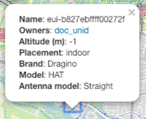
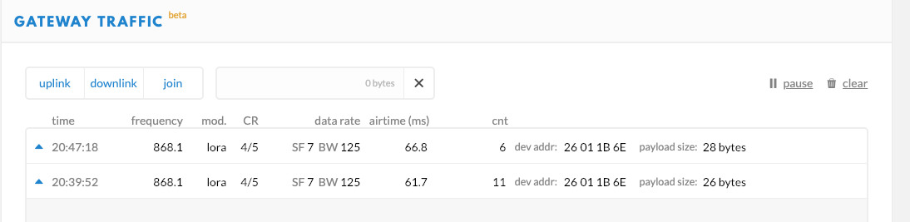
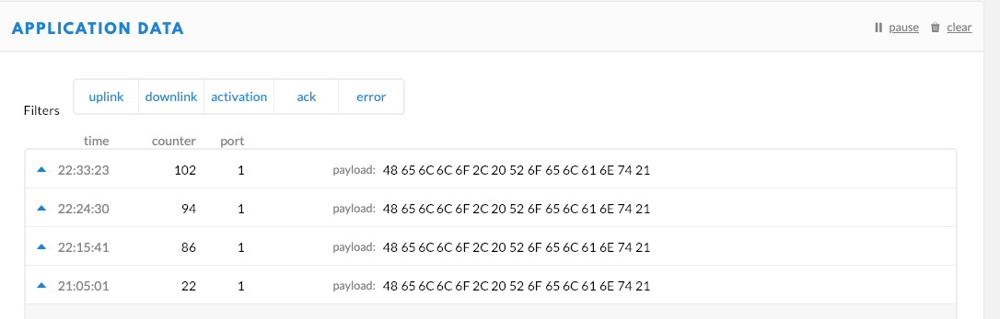
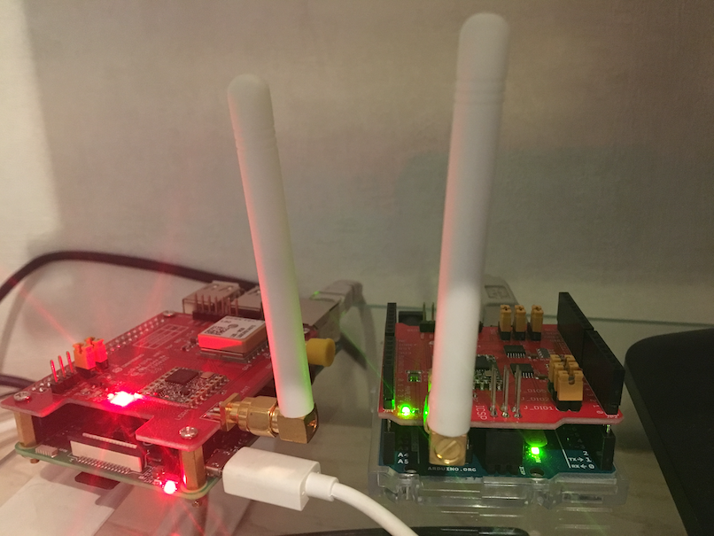

# LoRa Gateway

Single Channel LoRa gateway with a Raspberry Pi and a Dragino LoRa/GPS HAT - 868MHz

## Hardware On Top

Yeah fun, I've got an old pi model b lying around but the hardware on top (hat) specification only came out in 2014 (B+ model with 40 GPIO pin layout). My 2012 model has a 26 pin layout so that won't fly. Buy a new one :(

## Setting up the software

Instructions to build and connect are on [The Things Network](https://www.thethingsnetwork.org/docs/gateways/start/build.html). Or do as [the guy with the swiss accent](https://www.youtube.com/watch?v=Ya-QlEaonLU) (which is what we did).

## Communication

This single channel gateway uses the [single channel packet forwarder](https://github.com/Lora-net/packet_forwarder) (`single_chan_pkt_fwd`) program running on the PI.

Basic communication protocol between Lora gateway and server: LoraWAN. Here is a [list](https://www.link-labs.com/blog/complete-list-iot-network-protocols) of IOT netwerk protocols.

## The Things results

## Node to Gateway...over

Close enough?

