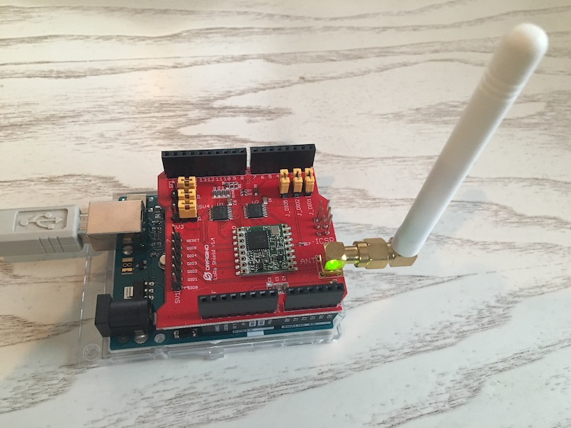
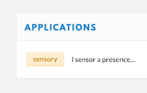
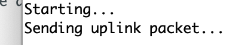

# LoRa Node with Arduino and Dragino Shield

We all know Arduino so the bases are covered. Just plug-on :) the LoRa Shield. It uses RF 868MHz, a public bandwidth European Low Power Networks (LPWAN) for communicating on LoRaWAN. The Dragino Lora Shield is a long range transceiver on a Arduino shield form factor. The Lora Shield allows the user to send data and reach extremely long ranges at low data-rates.

Okay, I got that last 2 sentences from [here](https://www.instructables.com/id/Use-Lora-Shield-and-RPi-to-Build-a-LoRaWAN-Gateway/) :)

## Connect to The Things Network (TTN) LoRaWAN

LoRaWAN is a protocol designed for creating large-scale public networks; the technology allows for sensors to talk to the internet without 3G or WiFi. Instructions to connect are [plentiful](https://www.google.com/search?q=connect+node+to+the+things+network). Or do as [the guy with the swiss accent](https://www.youtube.com/watch?v=duwUwXt-hs8).

## Arduino.app

I import [this library](https://github.com/matthijskooijman/arduino-lmic) (more on [installing additional Arduino Libraries](https://www.arduino.cc/en/guide/libraries)). Also I use [this example](https://github.com/SensorsIot/LoRa) as sketch to upload to the LoRa Node (-eq Arduino + Shield). For one it has a different pin mapping then the example on the local path (after importing the lib) `Arduino > Libraries > IBM_LMIC_framework > examples > ttn > ttn.ino`. Almost forgot to select the right serial port (usb in this case) and open the Serial Monitor :( but after that all was fine.

