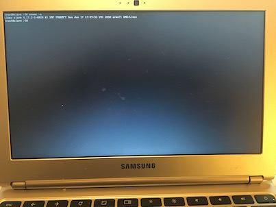

# chromeos

When I decided NOT to take my latest (somewhat fragile and expensive) powerbook on a rough holiday AND Google officially unveiled Project Crostini, I decided to
take my cheap-years-old-dust-collecting XE303C12 chromebook for a makeover. Linux apps on Chrome OS is usefull on a machine that is not costing too
much when damaged.

## crostini

So, I set out changing to developer channel (NOT developer mode) but off course as soon as I changed the "Experimental Crostini" flag disappeared. No
Linux (Beta) for my good old trusted chromebook. It should be noted that I haven't tried upgrading to a custom Linux kernel 4.4 but what would
be the point; the outdated ARM chip in my chromebook clearly does not support hardware virtualization ("egrep -c '(vmx|svm)' /proc/cpuinfo" equals
zero).  

[https://www.androidcentral.com/how-install-linux-apps-your-chromebook](https://www.androidcentral.com/how-install-linux-apps-your-chromebook)

So, what's next? A chroot perhaps? Enter crouton :)

## crouton (Ctrl-D)

Crouton is an universal chroot in Chrome OS developer mode. You start with Ctrl-D after enabling developer mode on the chromebook. It works fine and
is allmost too easy to install. It does make your chromebook less secure and lacks obvious functionality (it is after all a chroot jail) but hey, I can do Linux on my holidayz!

[https://github.com/dnschneid/crouton](https://github.com/dnschneid/crouton)

## usb boot (Ctrl-U)

Allright, but what if I want full-blown Linux on my ARM device? Well, there is an [excellent installation guide](https://archlinuxarm.org/platforms/armv7/samsung/samsung-chromebook) for the XE303C12 from Arch Linux. This works fine also. And because I installed on USB flashdrive the goold old cromebook now has triple boot (standard, chroot and usb).

