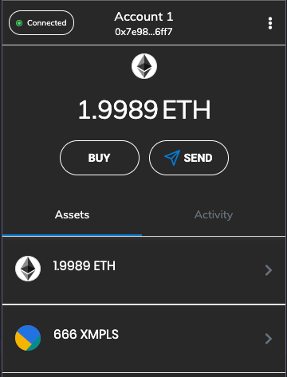

# chainblockers

Eximples (XMPLS) is a stable coin with a pegged exchange rate against the EURO. In other words it is a utility token only suitable for paying me. You can use them, after you bought them from me. For an EURO a piece... 💀

## create XMPLS

XMPLS originated on the Ethereum blockchain. Creating an utility token is easy as running a smart contract specifying the name, abbreviation, supply and some other properties for the token. Code it with [Solidity](https://docs.soliditylang.org/) in [Remix](https://remix.ethereum.org/), make sure your wallet is connected (gas!) and publish it. Inform your wallet (for example Brave Browser Wallet) of the new tokens. Done.

Or just browse to [the token factory](http://thetokenfactory.com/#/factory) and create your contract/token in under 1 minute :)

<video autoplay loop muted>
  <source src="XMPLS.mp4" type="video/mp4" />
  Your browser does not support the video tag.
</video>