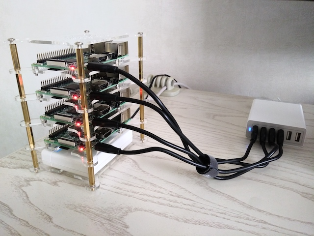

# Kubernetes on raspberry PIs (k8s on pis)

My obligatory k8s cluster on raspberry PI is based on [this gist](https://gist.github.com/alexellis/fdbc90de7691a1b9edb545c17da2d975). I set out to make the cluster portable so I can use it anywhere, a.o. for presentation/training purposes. For that I use a wireless AP (bottom shelf) and headless boots (add ssh and wpa_supplicant files to boot of sd card of each PI).

Every PI will boot into the wireless netwerk running on the AP. I'll join the same netwerk with my laptop and presto, I can ssh to each PI. Additionally the AP is connected by cable or WiFi (hotspot) to the internet.

